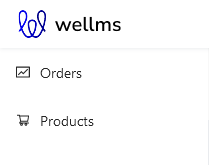
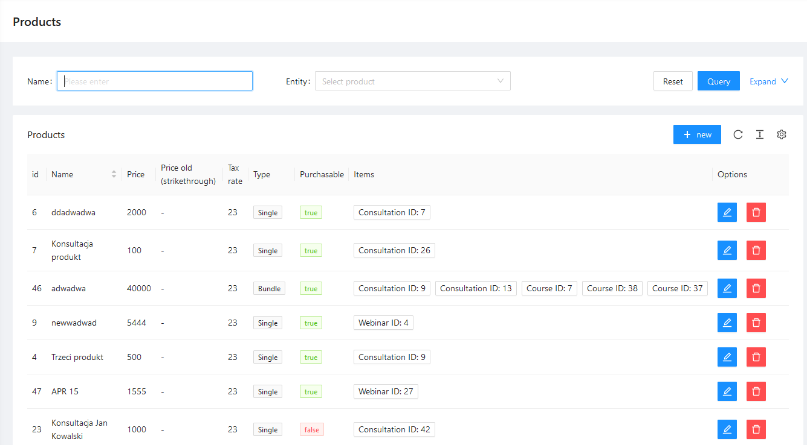
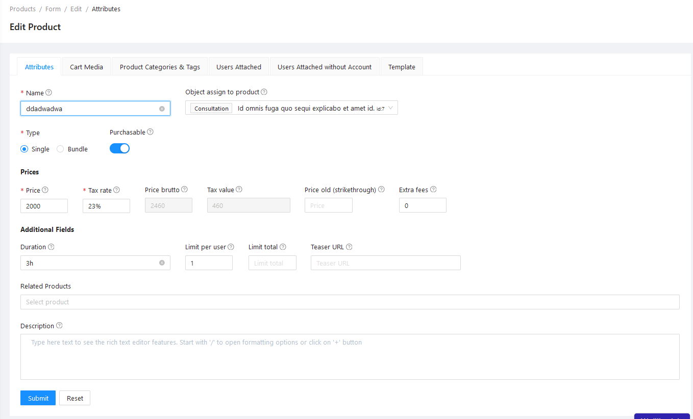
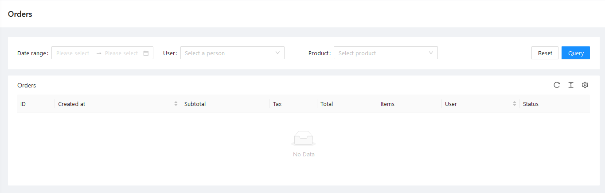

# Cart

## Purpose

This package lets you manage user Shopping Cart, and defines what is a buyable Product (and what are Productables, that is sellable things), that can be then added to the Cart.
This package also lets your users create Orders and buy content of their Carts.

## Installation

- `composer require escolalms/cart`
- `php artisan migrate`
- `php artisan db:seed --class="EscolaLms\Cart\Database\Seeders\CartPermissionSeeder"`

## Dependencies

This package depends on [EscolaLms/Payments](https://github.com/EscolaLMS/Payments) package for creating and processing Payments for Orders.

## Usage

### Product

`EscolaLms\Cart\Models\Product` is a Model that represents abstract buyable thing that can be added to Cart and bought. Product by itself has no additional functionality than being bought and assigned to Users.

Products consist of one (Single type products) or more (Bundle type products) Productables - that is, Models representing concrete things that are sold in your (LMS) application, for example Courses.
Productables must implement Productable interface.

### Productable

`EscolaLms\Cart\Contracts\Productable` interface defines how Model representing sellable things behave and which methods and relations they must contain.

### Defining Productables

To create (and sell) Products, you need to define Productables. A Productable is a Model implementing `EscolaLms\Cart\Models\Contracts` interface (and possibly using `EscolaLms\Cart\Contracts\ProductableTrait`). After adding this interface to your Model, you need to call `EscolaLms\Cart\Facades\Shop::registerProductableClass(Productable::class)` in one of your Service Providers boot method. This will enable using this Productable Model as a (part of) Product which can then be sold.

### Shop Facade

Shop Facade wraps `EscolaLms\Cart\Services\ProductService` giving access to methods related to registering Productables and managing Products.

### Cart Model

`EscolaLms\Cart\Models\Cart` is a model representing User Cart. Every User can have one active (existing) Cart at given time.

To create Cart (or retrieve current active Cart) for a given user, you need to call `EscolaLms\Cart\Services\ShopService::cartForUser($user)` method.

### Cart Manager

Cart and its content is managed using `EscolaLms\Cart\Services\CartManager` class instance attached to that Cart, instead of manipulating Cart object directly.
`CartManager` is used by `EscolaLms\Cart\Services\ShopService` (and you probably don't need to use it directly, as methods in ShopService represent all sensible use cases).

### Shop Service

Shop Service contains functionality related to managing Cart content (adding/removing Products), and purchasing Cart (storing Cart data as an Order and processing payment flow).

## Endpoints

All the endpoints are defined in .

## Tests

Run `./vendor/bin/phpunit` to run tests. See [tests](tests) directory as it's a quite good starting point for understanding how this package works.
Especially pay attention to [tests/Mocks](tests/Mocks) directory, as it represents core concepts of Productable and use of Productable Trait & Interface.

Test details  

## Events

- `EscolaLms\Cart\Events\AbandonedCartEvent` - emited when scheduled job finds a non-empty Cart older than 24 hours
- `EscolaLms\Cart\Events\OrderCancelled` - emited after payment processing is cancelled, which marks Order as cancelled
- `EscolaLms\Cart\Events\OrderCreated` - emited when new Order is created
- `EscolaLms\Cart\Events\OrderPaid` - emited after order was paid
- `EscolaLms\Cart\Events\ProductableAttached` - emited after Productable is attached to an User (for example after Product containing that Productable is attached to User, or admin endpoints for managing Productable attachments is used)
- `EscolaLms\Cart\Events\ProductableDetached` - analogous to ProductableAttached
- `EscolaLms\Cart\Events\ProductAddedToCart` - emitted when Product is added to Cart
- `EscolaLms\Cart\Events\ProductAttached` - emitted when Product is attached to User (after buying it or adding it using admin endpoint)
- `EscolaLms\Cart\Events\ProductBought` - emited after Product is bought by User
- `EscolaLms\Cart\Events\ProductDetached` - analogous to ProductAttached
- `EscolaLms\Cart\Events\ProductRemovedFromCart` - analogous to ProductAdded

## Listeners

- `EscolaLms\Cart\Listeners\PaymentSuccessListener` - this listener handles marking Orders as Paid after a Payment created for given Order is marked as Paid (listens to `EscolaLms\Payments\Events\PaymentSuccess` event)

## How to use this on frontend

### Admin panel

#### **Left menu**

#### **List of Products**

#### **Creating/editing Product**

#### **List of Orders**

#### **Details of Order**

## Permissions

Permissions are defined in [Enum](src/Enums/CartPermissionsEnum.php) and seeded in [Seeder](database/seeders/CartPermissionSeeder.php).

## Roadmap. Todo. Troubleshooting

- ???
